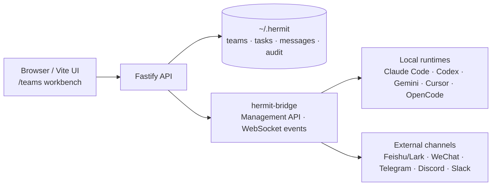

<p align="center">
  
</p>

<h1 align="center">openHermit</h1>

<p align="center">
  <a href="README.md"><strong>English</strong></a> ·
  <a href="README-CN.md"><strong>简体中文</strong></a>
</p>

<p align="center">
  <strong>本地优先的 AI Agent 团队控制平面。</strong><br/>
  创建团队、派发任务、观察 Agent 协作、审核结果，并把每一次循环都留在本机可审计。<br/>
  <strong>Local-first control plane for AI agent teams:</strong> create teams, assign work, watch agents collaborate, review results, and keep every loop auditable on your machine.
</p>

<p align="center">
  <a href="https://github.com/yancyuu/Hermit/stargazers"></a>
  <a href="https://github.com/yancyuu/Hermit/releases/latest"></a>
  <a href="https://www.npmjs.com/package/@yancyyu/openhermit"></a>
  <a href="https://www.npmjs.com/package/@yancyyu/openhermit"></a>
  <a href="LICENSE"></a>
  <a href="https://yancyuu.github.io/Hermit/"></a>
  
</p>

<p align="center">
  
</p>

<p align="center">
  <a href="#30-秒快速体验"><strong>快速体验</strong></a> ·
  <a href="#为什么选择-openhermit"><strong>为什么</strong></a> ·
  <a href="#截图"><strong>截图</strong></a> ·
  <a href="#支持的-agent-运行时"><strong>运行时</strong></a> ·
  <a href="https://yancyuu.github.io/Hermit/agent-manual.md"><strong>Agent 手册</strong></a>
</p>

---

## 30 秒快速体验

```bash
npx @yancyyu/openhermit@latest
```

打开 [http://127.0.0.1:5680/teams](http://127.0.0.1:5680/teams)，创建第一个团队，选择本地运行时，然后开始派发任务。

Hermit 本身是一个本地工作台。要真正运行 Agent，你仍然需要对应的本地 CLI、账号或 API 凭证，例如 Claude Code、Codex、Gemini、Cursor、OpenCode，或你的 bridge 运行时。

---

## 为什么选择 openHermit？

大多数 AI 编程工具擅长处理一段对话。但真实工作需要一个循环：

1. 发现或接收工作；
2. 拆分成任务；
3. 分配给合适的 Agent / 运行时；
4. 观察进度和消息；
5. 审核结果；
6. 在不丢失上下文的情况下重复执行。

openHermit 就是围绕这个循环的控制平面。

| 过去只能... | openHermit 提供... |
|:---|:---|
| 使用一次性聊天窗口 | 带成员、角色、任务、消息和运行时配置的团队工作区 |
| 手动运行各类 CLI | 面向 Claude Code、Codex、Gemini、Cursor、OpenCode 和 bridge 适配器的可视化 `/teams` 工作台 |
| 依赖隐藏的自动化脚本 | `~/.hermit/` 下可审计的本地状态：团队、任务、消息、事件和配置 |
| 临时同步状态 | 看板式任务状态、评论、交付记录和审核检查点 |
| 维护平台专用 Bot | 团队路由、频道 allowlist，以及基于 hermit-bridge 的 bridge 事件 |
| 担心多 Agent 并行编辑冲突 | 可选的 worktree 隔离，为并行 Agent 提供独立工作区 |

### 适合谁使用

- **独立开发者**：同时运行多个 AI 编程 Agent，并清楚知道谁改了什么。
- **团队负责人 / 产品经理**：把产品需求转成可见的 Agent 任务和可审核的交付物。
- **Loop 工程师**：构建可重复的 scan → dispatch → execute → verify → report 工作流。
- **本地优先的操作者**：希望不依赖托管控制平面，也能掌握运行时控制和审计轨迹。

---

## 截图

<table>
  <tr>
    <td align="center"><b>创建和管理 Agent 团队</b></td>
    <td align="center"><b>操作团队工作区</b></td>
  </tr>
  <tr>
    <td></td>
    <td></td>
  </tr>
  <tr>
    <td align="center"><b>跨团队跟踪工作</b></td>
    <td align="center"><b>配置本地运行时和频道</b></td>
  </tr>
  <tr>
    <td></td>
    <td></td>
  </tr>
</table>

<details>
<summary><strong>更多截图：Loop 用量、飞书/Lark 重点流程和管理界面</strong></summary>

<table>
  <tr>
    <td align="center"><b>Admin Loop</b></td>
    <td align="center"><b>用量总览</b></td>
    <td align="center"><b>Loop 工作流</b></td>
  </tr>
  <tr>
    <td></td>
    <td></td>
    <td></td>
  </tr>
  <tr>
    <td align="center"><b>Agent 门控任务</b></td>
    <td align="center"><b>频道感知的团队详情</b></td>
    <td align="center"><b>通用设置</b></td>
  </tr>
  <tr>
    <td></td>
    <td></td>
    <td></td>
  </tr>
</table>

</details>

> 想看视频？仓库中提供了 [`resources/demo.mp4`](resources/demo.mp4)。

---

## openHermit 能做什么

### Agent 团队，而不是孤立聊天

创建带成员、项目目录、运行时选择和可选 worktree 隔离的团队。每个团队都有自己的工作区，用来管理任务、消息、配置和审计轨迹。

### 面向 AI 工作的任务看板

把 Hermit 当作让 Agent 工作可见的地方：创建任务、发表评论、跟踪状态、保留交付上下文，并在接受结果前完成审核。

### 本地优先的运行时控制

Hermit 默认把状态保存在本机 `~/.hermit/`。它不提供模型、不托管你的仓库，也不会替代你的本地 CLI。它负责协调你已经安装并授权的运行时。

### 把外部频道接入团队工作流

使用 hermit-bridge 将团队消息和事件连接到飞书/Lark、微信、Telegram、Discord、Slack 或其他频道适配器。Hermit 负责团队路由、allowlist 和审计边界；平台 Bot 能力取决于你的 hermit-bridge 配置。

### 可重复的 Loop Engineering

把手动 Agent 操作变成循环：扫描工作、派发给团队、观察执行、验证结果、报告变化。目标不是“更多 Agent”，而是可重复、可检查的进展。

---

## 工作原理



当前产品形态：

- **前端**：Vite + React 19 + TypeScript
- **后端**：Fastify 5 + Node.js
- **默认路由**：`/teams`
- **默认状态目录**：`~/.hermit/`
- **分发方式**：npm CLI 包 `@yancyyu/openhermit`
- **当前边界**：此包不包含 Electron 桌面版，也不包含嵌入式 PTY 终端

---

## 支持的 Agent 运行时

openHermit 可以协调你已经在本机安装并完成认证的运行时。适配深度取决于具体运行时和你的 hermit-bridge 配置。

| 支持级别 | 运行时标识 |
|:---|:---|
| **一等适配器** | `claudecode`, `codex`, `gemini`, `opencode`, `cursor` |
| **已注册 / 兼容标识** | `devin`, `qoder`, `pi`, `iflow`, `acp`, `kimi`, `tmux` |

一等适配器通常会暴露更丰富的安装状态、凭证、MCP、Skills 或环境管理能力。兼容标识可用于团队配置、bridge 或实验性集成；具体行为取决于你的本地环境。

---

## 安装与运维

### 无需安装直接运行

```bash
npx @yancyyu/openhermit@latest
```

### 全局安装

```bash
npm install -g @yancyyu/openhermit@latest --prefer-online
openhermit
```

### 常用命令

```bash
openhermit                # 启动工作台
openhermit --daemon       # 后台运行
openhermit status         # 查看 daemon 状态
openhermit stop           # 停止 daemon
openhermit --port 8080    # 指定端口
openhermit --version      # 打印版本
openhermit update         # 自更新
```

### 让 Agent 帮你安装

把公开 runbook 交给你的本地 AI Agent：

```text
Read https://yancyuu.github.io/Hermit/agent-manual.md and follow the installation and operations guide to deploy openHermit on this machine.
```

同时也发布了适合 Agent 阅读的文档：

- [Public guide](https://yancyuu.github.io/Hermit/)
- [Agent manual](https://yancyuu.github.io/Hermit/agent-manual.md)
- [LLM index](https://yancyuu.github.io/Hermit/llms.txt)

---

## 创建第一个团队

1. 打开 `/teams`。
2. 点击 **创建数字员工**。
3. 填写团队名称和 slug。
4. 选择 harness / runtime，例如 `claudecode`。
5. 选择项目目录；如果并行编辑需要隔离，可以启用 worktree isolation。
6. 如果团队需要接收外部消息，配置频道绑定和 allowlist。
7. 保存后打开团队详情页，创建任务，并启动 Agent loop。

---

## 当前能力与边界

| 领域 | 当前状态 |
|:---|:---|
| **Teams** | 团队配置、成员、项目工作区、运行时设置、可选 worktree 隔离 |
| **Tasks** | 团队看板、评论、外部派发投影、交付 / 审核状态 |
| **Messages** | 团队消息、跨团队消息、频道消息、Bridge 事件 |
| **Channels** | Hermit 负责路由、allowlist 和审计；hermit-bridge 承载平台适配器 |
| **Cross-team collaboration** | Redis-backed dispatch 支持 receive/start/progress/complete/approve/revision 风格流程；完整的 offer/bid/lease/event Task Bus 是目标模型 |
| **Local-first storage** | 配置、团队、任务、消息和审计数据默认保存在 `~/.hermit/` |
| **Not included here** | 托管模型、托管仓库、Electron 桌面打包、嵌入式 PTY 终端 |

---

## 文档

- [文档索引](docs/README.md)
- [团队管理架构](docs/team-management/README.md)
- [跨团队协作工作流](docs/team-management/cross-team-collaboration.md)
- [Feature Architecture Standard](docs/FEATURE_ARCHITECTURE_STANDARD.md)
- [Release Guide](docs/RELEASE.md)
- [Changelog](docs/CHANGELOG.md)

---

## 开发

```bash
pnpm install
pnpm dev
pnpm typecheck
pnpm test
pnpm build:web
```

本地开发如果需要外部频道（飞书/Lark、微信、Telegram、Discord、Slack 等），请在 `pnpm dev` 前或同时启动 `hermit-bridge`：

```bash
node node_modules/hermit-bridge/run.js --force -config ~/.hermit/hermit-bridge/config.toml
```

发布版 `openhermit` CLI 会在需要时自动启动内置的 `hermit-bridge`，并把旧运行时文件从 `~/.hermit/cc-connect/` 迁移到 `~/.hermit/hermit-bridge/`。本地 `pnpm dev` 保持显式启动，方便开发者观察 bridge 日志并独立重启。

本仓库使用 pnpm。除非对应实现和文档已经落地，请不要把 Electron 打包、嵌入式 PTY、托管模型服务或完整目标 Task Bus 描述成当前已发布能力。

---

## 社区与支持

如果 openHermit 帮你更可靠地运行 Agent 工作，欢迎给仓库点 Star —— 这能帮助更多人发现这个项目。

- Issues: [github.com/yancyuu/Hermit/issues](https://github.com/yancyuu/Hermit/issues)
- Releases: [github.com/yancyuu/Hermit/releases](https://github.com/yancyuu/Hermit/releases)

---

## License

[AGPL-3.0](LICENSE)
