<p align="center">
  
</p>

<h1 align="center">openHermit</h1>

<p align="center">
  <strong>Local-first control plane for AI agent teams.</strong><br/>
  Create teams, assign work, watch agents collaborate, review results, and keep every loop auditable on your machine.<br/>
  <strong>本地优先的 AI Agent 团队工作台：</strong>创建团队、派发任务、观察协作、审核交付，把一次性聊天变成可重复的工程循环。
</p>

<p align="center">
  <a href="https://github.com/yancyuu/Hermit/stargazers"></a>
  <a href="https://github.com/yancyuu/Hermit/releases/latest"></a>
  <a href="https://www.npmjs.com/package/@yancyyu/openhermit"></a>
  <a href="https://www.npmjs.com/package/@yancyyu/openhermit"></a>
  <a href="LICENSE"></a>
  <a href="https://yancyuu.github.io/Hermit/"></a>
  
</p>

<p align="center">
  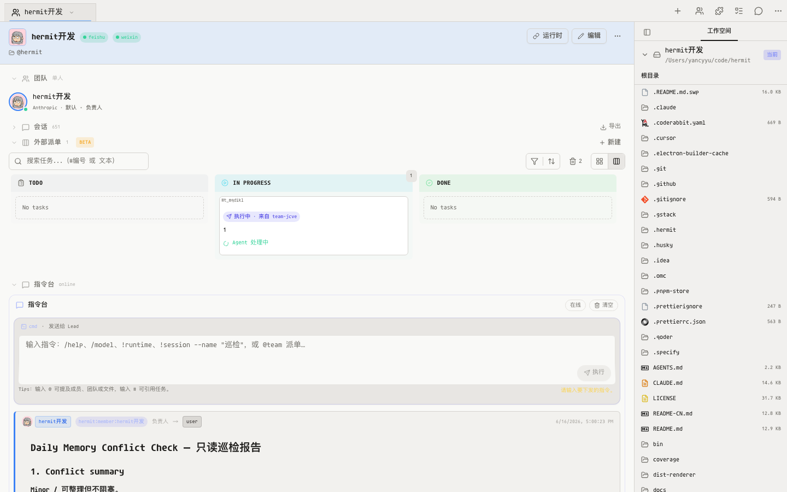
</p>

<p align="center">
  <a href="README-CN.md"><strong>简体中文</strong></a> ·
  <a href="#try-it-in-30-seconds"><strong>Try it</strong></a> ·
  <a href="#why-openhermit"><strong>Why</strong></a> ·
  <a href="#screenshots"><strong>Screenshots</strong></a> ·
  <a href="#supported-agent-runtimes"><strong>Runtimes</strong></a> ·
  <a href="https://yancyuu.github.io/Hermit/agent-manual.md"><strong>Agent manual</strong></a>
</p>

---

## Try it in 30 seconds

```bash
npx @yancyyu/openhermit@latest
```

Open [http://127.0.0.1:5680/teams](http://127.0.0.1:5680/teams), create your first team, choose a local runtime, and start assigning work.

Hermit itself is a local workbench. To run real agents you still need the corresponding local CLI/account/API credentials for Claude Code, Codex, Gemini, Cursor, OpenCode, or your bridge runtime.

---

## Why openHermit?

Most AI coding tools are great at one conversation. Real work needs a loop:

1. discover or receive work,
2. split it into tasks,
3. assign the right agent/runtime,
4. observe progress and messages,
5. review the result,
6. repeat without losing context.

openHermit is the control plane around that loop.

| Instead of... | openHermit adds... |
|:---|:---|
| One-off chat windows | Team workspaces with members, roles, tasks, messages, and runtime config |
| Running CLIs by hand | A visible `/teams` workbench for Claude Code, Codex, Gemini, Cursor, OpenCode, and bridge adapters |
| Hidden automation scripts | Auditable local state under `~/.hermit/`: teams, tasks, messages, events, and configuration |
| Ad-hoc status updates | Kanban-style task state, comments, delivery records, and review checkpoints |
| Platform-specific bots | Team routing, channel allowlists, and hermit-bridge powered bridge events |
| Fragile multi-agent edits | Optional worktree isolation for parallel agent workspaces |

### Built for

- **Solo developers** running several AI coding agents without losing track of who changed what.
- **Team leads / PMs** turning product requests into visible agent tasks and reviewable outcomes.
- **Loop engineers** building repeatable scan → dispatch → execute → verify → report workflows.
- **Local-first operators** who want runtime control and audit trails without a hosted control plane.

---

## Screenshots

<table>
  <tr>
    <td align="center"><b>Create and manage agent teams</b></td>
    <td align="center"><b>Operate a team workspace</b></td>
  </tr>
  <tr>
    <td>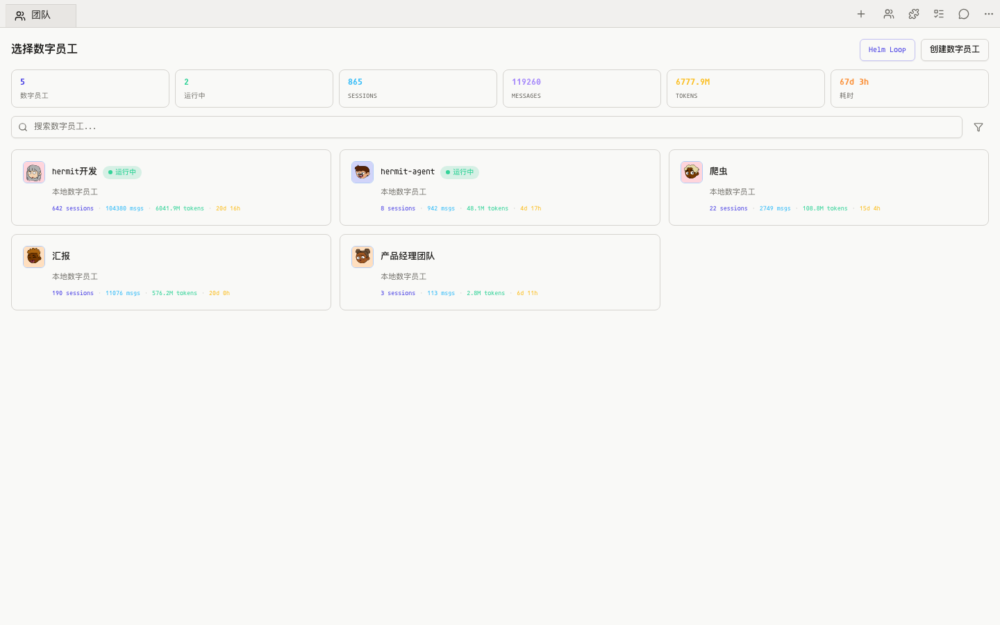</td>
    <td></td>
  </tr>
  <tr>
    <td align="center"><b>Track work across teams</b></td>
    <td align="center"><b>Configure local runtimes and channels</b></td>
  </tr>
  <tr>
    <td>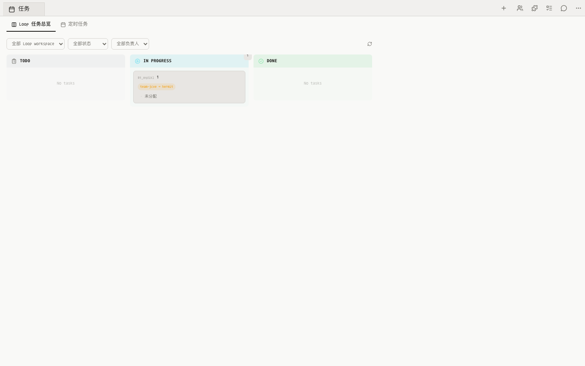</td>
    <td>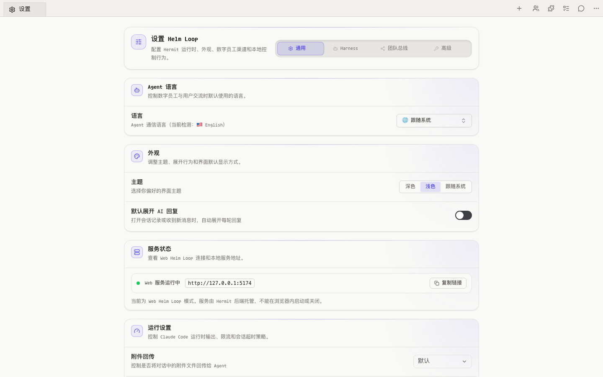</td>
  </tr>
</table>

<details>
<summary><strong>More screenshots: Loop usage, Feishu/Lark focused flows, and admin surfaces</strong></summary>

<table>
  <tr>
    <td align="center"><b>Admin Loop</b></td>
    <td align="center"><b>Usage overview</b></td>
    <td align="center"><b>Loop workflows</b></td>
  </tr>
  <tr>
    <td>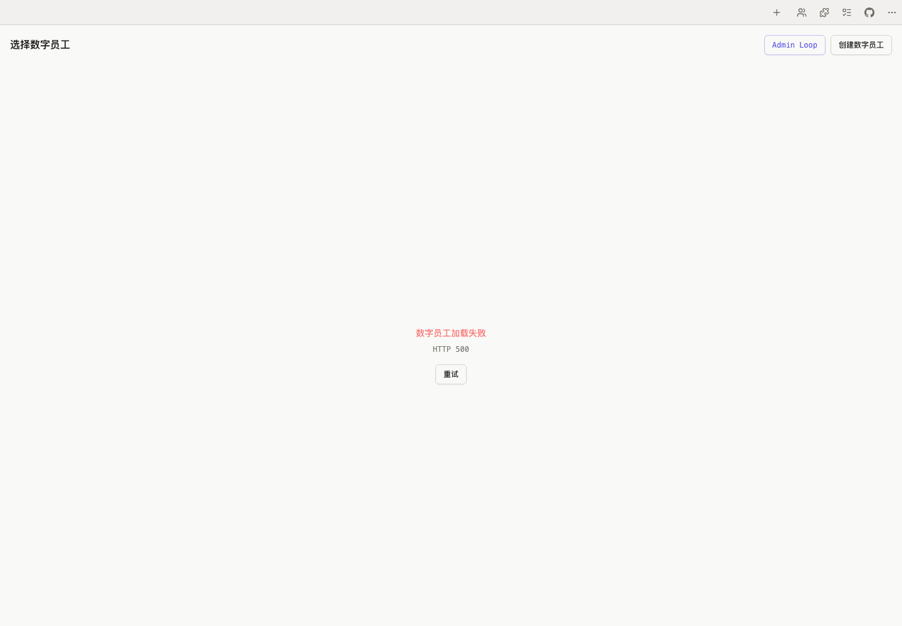</td>
    <td>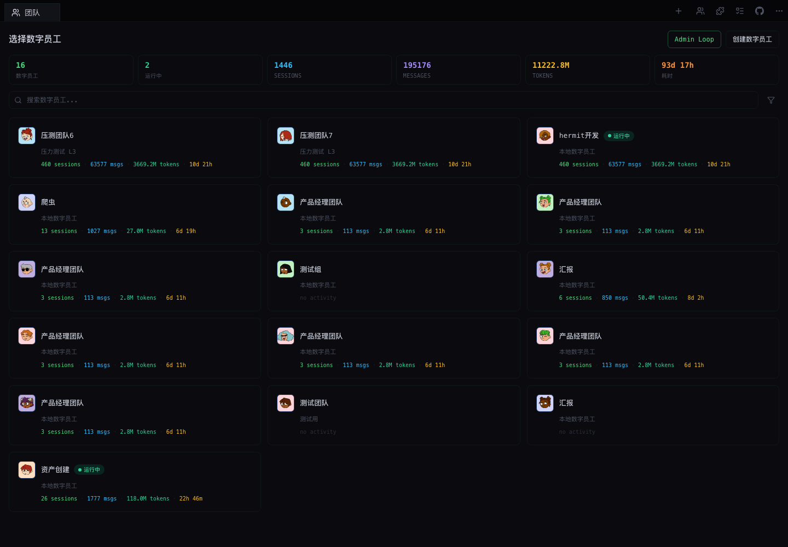</td>
    <td>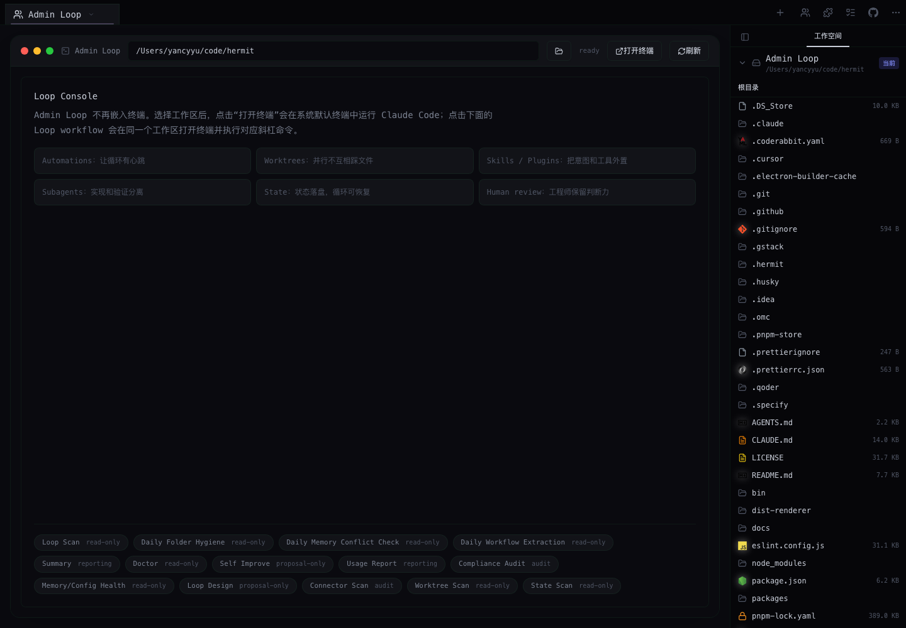</td>
  </tr>
  <tr>
    <td align="center"><b>Agent gated tasks</b></td>
    <td align="center"><b>Channel-aware team detail</b></td>
    <td align="center"><b>General settings</b></td>
  </tr>
  <tr>
    <td>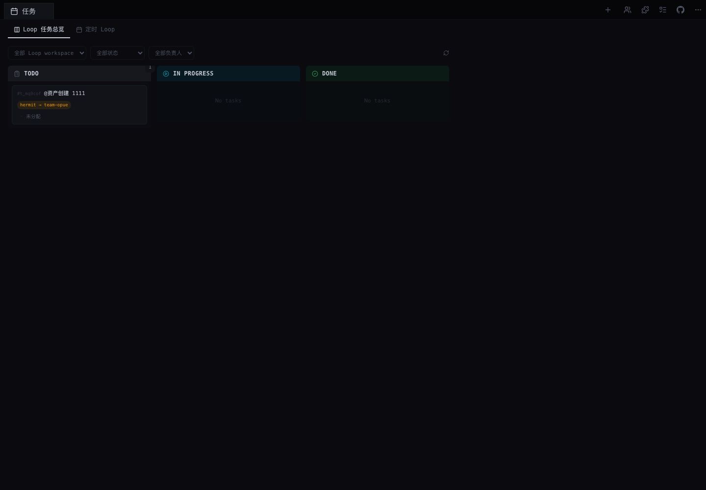</td>
    <td>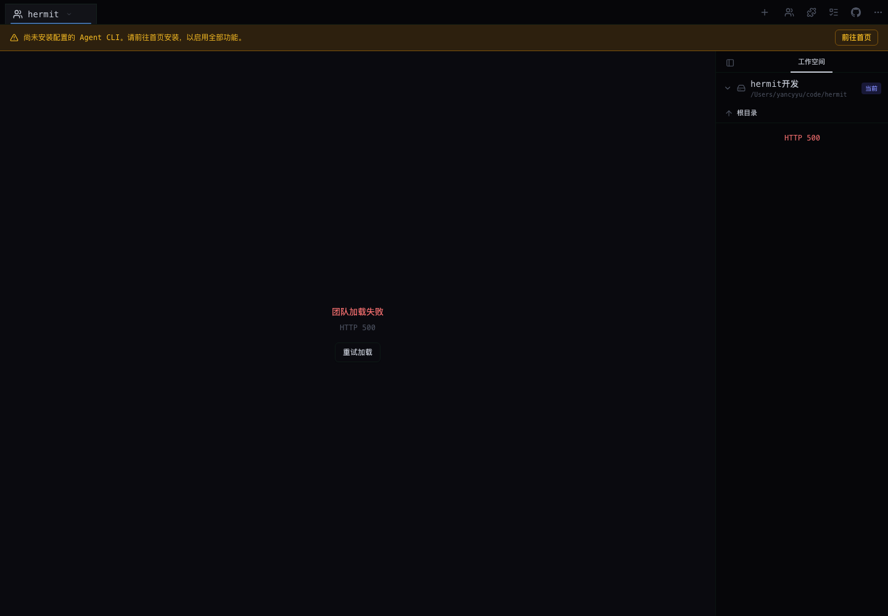</td>
    <td>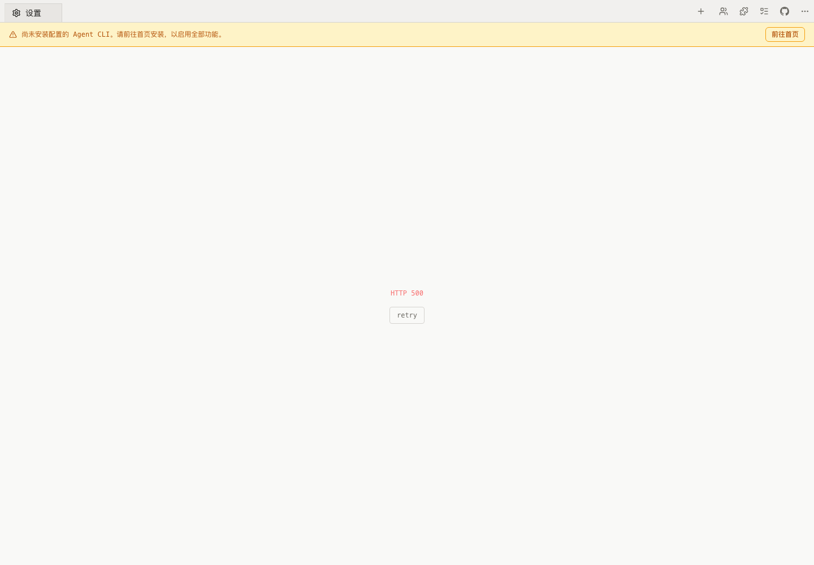</td>
  </tr>
</table>

</details>

> Prefer video? See [`resources/demo.mp4`](resources/demo.mp4) in this repository.

---

## What openHermit does

### Agent teams, not isolated chats

Create teams with members, project directories, runtime choices, and optional worktree isolation. Each team gets its own workspace for tasks, messages, configuration, and audit trails.

### Task board for AI work

Use Hermit as the place where agent work becomes visible: create tasks, comment on them, track status, preserve delivery context, and review outcomes before accepting them.

### Local-first runtime control

Hermit stores state locally by default in `~/.hermit/`. It does not provide models, host your repositories, or replace your local CLIs. It coordinates the runtimes you already install and authorize.

### Bridge external channels into team workflows

Use hermit-bridge to connect team messages and events to Feishu/Lark, WeChat, Telegram, Discord, Slack, or other channel adapters. Hermit handles team routing, allowlists, and audit boundaries; platform Bot capabilities depend on your hermit-bridge setup.

### Repeatable Loop Engineering

Turn manual agent operations into loops: scan for work, dispatch to a team, observe execution, verify results, and report what changed. The goal is not “more agents”; it is repeatable, inspectable progress.

---

## How it works

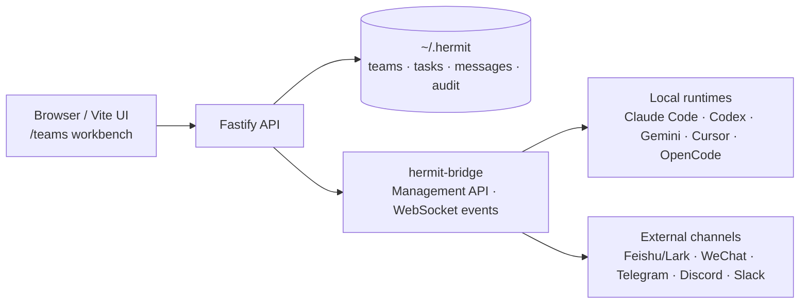

Current product shape:

- **Frontend**: Vite + React 19 + TypeScript
- **Backend**: Fastify 5 + Node.js
- **Default route**: `/teams`
- **Default state directory**: `~/.hermit/`
- **Distribution**: npm CLI package `@yancyyu/openhermit`
- **Current boundary**: no Electron desktop package and no embedded PTY terminal in this package

---

## Supported Agent runtimes

openHermit can coordinate the runtimes you have installed and authenticated locally. Adapter depth depends on the runtime and your hermit-bridge configuration.

| Support level | Runtime identifiers |
|:---|:---|
| **First-class adapters** | `claudecode`, `codex`, `gemini`, `opencode`, `cursor` |
| **Registered / compatible identifiers** | `devin`, `qoder`, `pi`, `iflow`, `acp`, `kimi`, `tmux` |

First-class adapters usually expose richer install status, credentials, MCP, Skills, or environment management. Compatible identifiers are available for team configuration, bridging, or experimental integration; exact behavior depends on your local environment.

---

## Installation and operations

### Run without installing

```bash
npx @yancyyu/openhermit@latest
```

### Install globally

```bash
npm install -g @yancyyu/openhermit@latest --prefer-online
openhermit
```

### Useful commands

```bash
openhermit                # start the workbench
openhermit --daemon       # run in the background
openhermit status         # inspect daemon status
openhermit stop           # stop the daemon
openhermit --port 8080    # choose a port
openhermit --version      # print version
openhermit update         # self-update
```

### Let an agent install it

Give your local AI agent the public runbook:

```text
Read https://yancyuu.github.io/Hermit/agent-manual.md and follow the installation and operations guide to deploy openHermit on this machine.
```

Agent-readable docs are also published at:

- [Public guide](https://yancyuu.github.io/Hermit/)
- [Agent manual](https://yancyuu.github.io/Hermit/agent-manual.md)
- [LLM index](https://yancyuu.github.io/Hermit/llms.txt)

---

## Create your first team

1. Open `/teams`.
2. Click **创建数字员工**.
3. Fill in a team name and slug.
4. Choose a harness/runtime, for example `claudecode`.
5. Select a project directory; enable worktree isolation when parallel edits should stay separated.
6. Configure channel bindings and allowlists if the team should receive external messages.
7. Save, open the team detail page, create a task, and start the agent loop.

---

## Current capabilities and boundaries

| Area | Current status |
|:---|:---|
| **Teams** | Team config, members, project workspace, runtime settings, optional worktree isolation |
| **Tasks** | Team kanban, comments, external dispatch projection, delivery/review state |
| **Messages** | Team messages, cross-team messages, channel messages, Bridge events |
| **Channels** | Hermit handles routing, allowlists, and audit; hermit-bridge carries platform adapters |
| **Cross-team collaboration** | Redis-backed dispatch supports receive/start/progress/complete/approve/revision style flows; the full offer/bid/lease/event Task Bus is the target model |
| **Local-first storage** | Config, teams, tasks, messages, and audit data default to `~/.hermit/` |
| **Not included here** | Hosted models, hosted repositories, Electron desktop packaging, embedded PTY terminal |

---

## Documentation

- [Docs index](docs/README.md)
- [Team Management Architecture](docs/team-management/README.md)
- [Cross-Team Collaboration Workflow](docs/team-management/cross-team-collaboration.md)
- [Feature Architecture Standard](docs/FEATURE_ARCHITECTURE_STANDARD.md)
- [Release Guide](docs/RELEASE.md)
- [Changelog](docs/CHANGELOG.md)

---

## Development

```bash
pnpm install
pnpm dev
pnpm typecheck
pnpm test
pnpm build:web
```

For local development that needs external channels (Feishu/Lark, WeChat, Telegram, Discord, Slack, etc.), start `hermit-bridge` before or alongside `pnpm dev`:

```bash
node node_modules/hermit-bridge/run.js --force -config ~/.hermit/hermit-bridge/config.toml
```

The published `openhermit` CLI auto-starts the bundled `hermit-bridge` when needed and migrates legacy runtime files from `~/.hermit/cc-connect/` to `~/.hermit/hermit-bridge/`. Local `pnpm dev` is intentionally explicit so developers can watch bridge logs and restart it independently.

Use pnpm for this repository. Please do not describe Electron packaging, embedded PTY, hosted model serving, or the full target Task Bus as current shipped capability unless the implementation and docs have landed.

---

## Community and support

If openHermit helps you run agent work more reliably, please star the repo — it helps more people discover the project.

- Issues: [github.com/yancyuu/Hermit/issues](https://github.com/yancyuu/Hermit/issues)
- Releases: [github.com/yancyuu/Hermit/releases](https://github.com/yancyuu/Hermit/releases)

---

## License

[AGPL-3.0](LICENSE)
