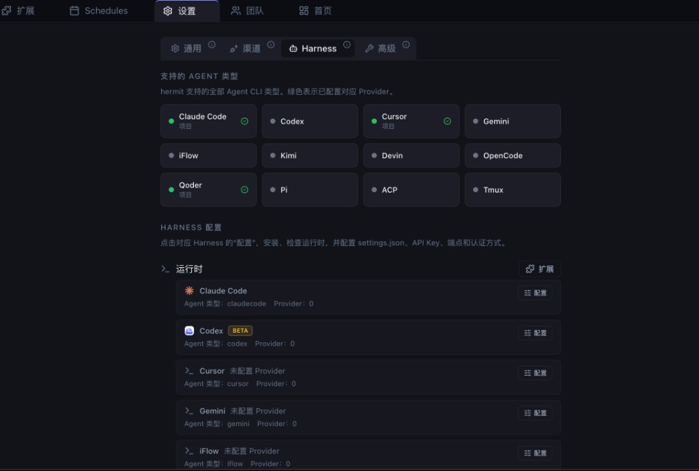
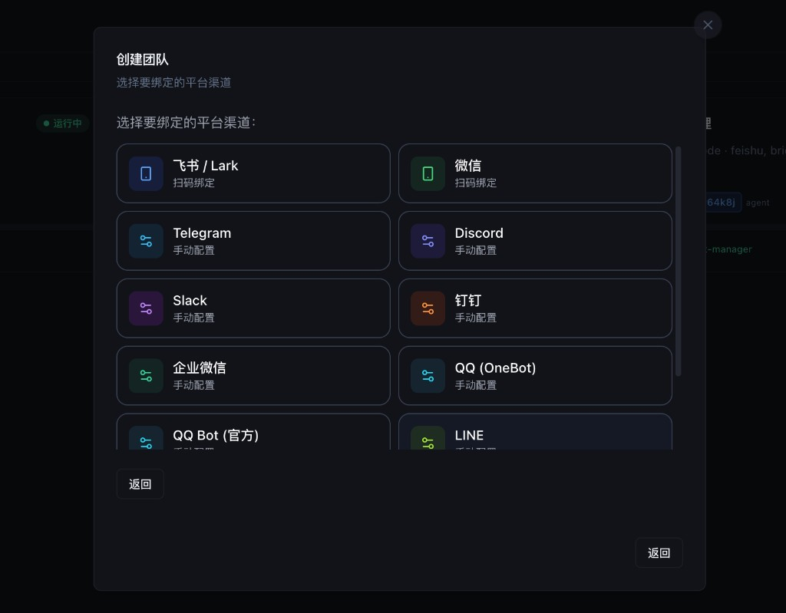

<p align="center">
  
</p>

<h1 align="center">openHermit</h1>

<p align="center">
  <strong>超级个体的 AI 基础设施 — 一个人，一块看板，一支军队</strong><br/>
  用代码重构公司形态，让 AI Agent 团队自主协作、自动流转、自动驾驶。
</p>

<p align="center">
  <a href="https://github.com/yancyuu/Hermit/releases/latest"></a>
  <a href="LICENSE"></a>
  
</p>

<p align="center">
  
</p>

---

## 为什么需要 openHermit？

目前的 AI Agent 赛道充满了一个巨大误区：**大家都在试图用人类的"HR 组织架构"来管理 AI。**
让大模型扮演"资深前端"或"产品经理"，本质上是在模仿人类的**职责驱动**（因岗设人）。这注定会走向死锁——因为人类有精力上限和认知边界，才需要划分部门和扯皮；而 AI 没有。

**openHermit 的核心哲学：用管理机器的方式管理 Agent，而不是用管理人的方式。**

任务流是一张 DAG，每个节点代表一种确定的状态（Pending → Running → Review → Done）。遇到网络波动或反爬环境，状态机自动 `Fail-Over`，流水线永远不会因为"超出角色职责"而卡死。

---

## 产品截图

<table>
  <tr>
    <td align="center"><b>团队列表</b></td>
    <td align="center"><b>团队详情</b></td>
  </tr>
  <tr>
    <td></td>
    <td></td>
  </tr>
  <tr>
    <td align="center"><b>运行时配置</b></td>
    <td align="center"><b>渠道绑定</b></td>
  </tr>
  <tr>
    <td></td>
    <td></td>
  </tr>
</table>

---

## 核心能力

| 能力 | 说明 |
|:---|:---|
| **Agent 团队** | 创建多角色团队，Agent 自主并行工作 |
| **看板管理** | 任务状态实时流转 — 待办、执行中、审查、完成 |
| **代码审查** | 每个任务独立的 Diff 视图，支持接受/拒绝/评论 |
| **跨团队通信** | Agent 之间跨团队结构化消息传递 |
| **直接消息** | 向任意 Agent 发消息、评论任务、快捷操作 |
| **会话分析** | 深度拆解：Bash 命令、推理链、子进程 |
| **上下文监控** | 按类别追踪 Token 消耗，掌控上下文窗口 |
| **MCP 集成** | 内置 MCP Server，支持外部工具和 Agent 插件 |
| **权限控制** | 精细化允许/拒绝工具执行和 Agent 操作 |
| **渠道绑定** | 接入飞书、Slack、Telegram、Discord、微信等 10+ 渠道 |
| **零配置上手** | 内置 Claude Code CLI 安装和认证 |

---

## 极速部署

### 方式一：npx（免安装直接运行）

```bash
npx @yancyyu/openhermit@latest
```

启动后打开 [http://127.0.0.1:5680](http://127.0.0.1:5680)

### 方式二：全局安装

```bash
npm install -g @yancyyu/openhermit@latest --prefer-online
openhermit
```

### 常用命令

```bash
openhermit                # 启动工作台
openhermit --daemon       # 后台运行
openhermit status         # 查看后台状态
openhermit stop           # 停止后台服务
openhermit --port 8080    # 指定端口
openhermit --version      # 查看版本
openhermit update         # 自更新
```

### 本地开发

```bash
git clone https://github.com/yancyuu/hermit.git
cd hermit
pnpm install
pnpm dev
```

浏览器打开 [http://localhost:5174](http://localhost:5174)，开发模式默认连接本机运行时。

### 创建第一个 AI 团队

1. 点击 **「新建团队」**
2. 填写团队名，选择 harness（如 `claudecode`）
3. 选择本地项目目录和运行时
4. 保存 → 看板就绪，任务等你分配

---

## 支持的 Agent 运行时

openHermit 不提供闭源模型，也不劫持你的代码。它是一个高度可扩展的本地壳层。

| 标识 | 运行时 | 标识 | 运行时 |
|:---|:---|:---|:---|
| `claudecode` | Anthropic Claude Code CLI | `devin` | Cognition Devin |
| `codex` | OpenAI Codex CLI | `opencode` | OpenCode CLI |
| `cursor` | Cursor IDE Agent | `qoder` | Qoder CLI |
| `gemini` | Google Gemini CLI | `pi` | Inflection Pi |
| `iflow` | iFlow CLI | `acp` | Agent Communication Protocol |
| `kimi` | Moonshot Kimi | `tmux` | 经典 Tmux Session |

---

## 核心架构：TPC 引擎

```
┌─────────────────────────────────────────────┐
│                 openHermit                   │
│                                             │
│  ┌─────────┐  ┌─────────┐  ┌─────────────┐ │
│  │  Team A  │  │  Team B  │  │  Team C     │ │
│  │ (agents) │  │ (agents) │  │ (agents)    │ │
│  └────┬─────┘  └────┬─────┘  └──────┬─────┘ │
│       │              │               │       │
│  ─────┴──────────────┴───────────────┴────── │
│         看板 · 消息总线                      │
│  ─────────────────────────────────────────── │
│       MCP Server · Bridge 协议               │
│  ─────────────────────────────────────────── │
│       渠道（飞书 · Slack · Telegram · ...）  │
└─────────────────────────────────────────────┘
```

- **[T]eam（隔离与并发）** — 不同团队独立运行时，全局看板跨团队调度
- **[P]rocess（状态流转）** — 任务以原子化状态为核心，MCP 动态注入能力
- **[C]hannel（全渠道触达）** — 10+ 消息渠道统一控制面，消息即指令

---

## 技术栈

| 层级 | 技术 |
|:---|:---|
| 前端 | React 19 · TypeScript 5 · Tailwind CSS 3 · Zustand 4 |
| 后端 | Fastify (Node.js) |
| 桌面 | Electron 40 |
| 存储 | 本地文件（`~/.hermit/`） |
| 通信 | WebSocket Bridge + HTTP Management API |
| 协议 | MCP over HTTP（SSE + JSON-RPC） |

---

## 贡献

欢迎 PR。Fork → Branch → Push → PR，标准流程。

```bash
pnpm install
pnpm dev        # 启动开发服务
pnpm check      # 完整质量检查（类型 + Lint + 测试 + 构建）
```

---

## 许可证

[AGPL-3.0](LICENSE)
