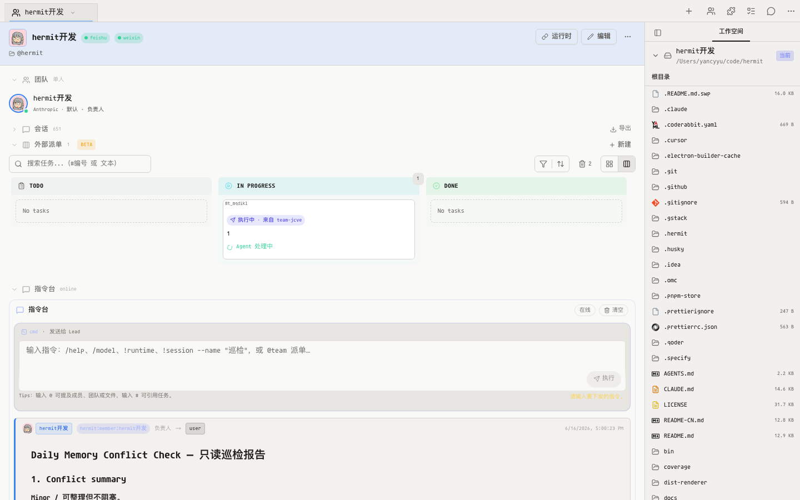
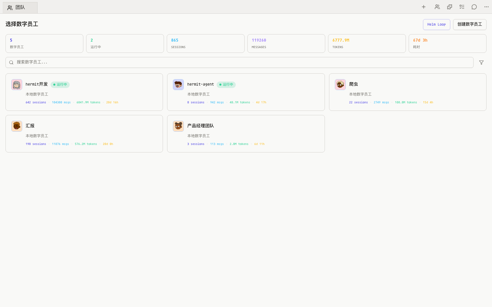
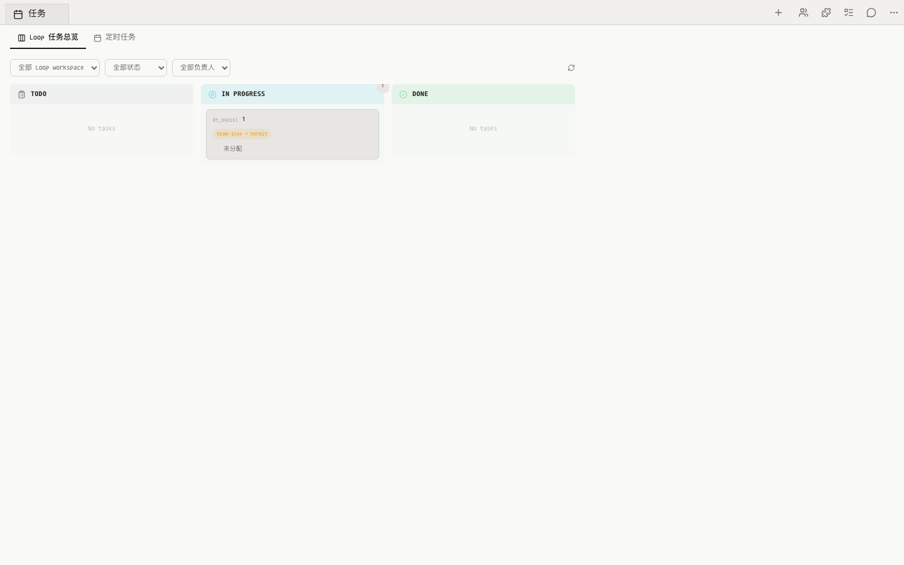

<p align="center">
  
</p>

<h1 align="center">AgentCli</h1>

<p align="center">
  <strong>开源 · 本地优先的 AI 数字员工工作台</strong><br/>
  CLI 给 agent，Web 给人。自动采集 Claude Code / Codex / Cursor 等运行时用量，统一管理数字员工团队。<br/>
  <sub>Local-first, open-source AI workforce workbench. CLI for agents, Web for humans.</sub>
</p>

<p align="center">
  <a href="https://www.npmjs.com/package/@yancyyu/agentcli"></a>
  <a href="https://www.npmjs.com/package/@yancyyu/agentcli"></a>
  <a href="LICENSE"></a>
</p>

<p align="center">
  
</p>

---

## 这是什么

AgentCli 是一个**开源、本地优先的 AI 数字员工工作台**。它让你像管理真实团队一样管理 AI Agent：组建团队、分配任务、追踪进度、审核交付——同时自动采集多种运行时（Claude Code、Codex、Cursor…）的用量并统一上报。

> **CLI for agents, Web for humans.** Web 工作台给人看和管；CLI 给 agent / operator 查询状态、上报用量、触发操作，所有命令支持 `--json` 输出机器可读结果。

### 解决的问题

- AI Agent 越来越多，但**谁在做什么、进展如何**没有统一视图
- 多种运行时各自独立，**无法协调管理与统一计量**
- 团队 AI 使用缺乏**可见性、归因和审计能力**

---

## 两个产品，一条路径

先免费用起来，需要团队化时再升级。**AgentCli 开源免费，AgentBus 是付费的企业增值服务。**

| 产品 | 定位 | 价格 | 什么时候用 |
|:--|:--|:--|:--|
| **AgentCli** | 本地优先的 CLI + Web 工作台。你现在就能装、立刻能用。 | **开源免费**（AGPL-3.0） | 单机使用、脚本化、自动化、本地数字员工团队 |
| **AgentBus** | 中心化数据总线，把单机工具升级成团队 / 企业平台。 | **企业版 · 增值服务** | 多人 / 多团队协作、IM 触发任务、企业级用量看板 |

> 关系一句话：**AgentCli（开源）是操作面，AgentBus（企业版）是协调骨干。** 不接 Bus = 单机模式，照样完整能跑；接入 Bus 才解锁多人协作与企业能力。

---

## 30 秒快速体验

```bash
npx @yancyyu/agentcli@latest
```

打开 [http://127.0.0.1:5680](http://127.0.0.1:5680)，创建你的第一个数字员工团队。

```bash
# 或全局安装
npm install -g @yancyyu/agentcli@latest
agentcli
```

<details>
<summary>macOS / Linux 一键安装脚本</summary>

```bash
curl -fsSL https://yancyuu.github.io/agentcli/install.sh | bash
```
</details>

---

## 🤖 给 Agent 的最小上手路径（说明书）

> 把这段交给一个 AI agent，它能照着装好、登录、上报、自检。

```bash
# 1. 安装（三选一）
npm install -g @yancyyu/agentcli@latest      # 或 npx @yancyyu/agentcli@latest
agentcli --version                            # ✅ 成功标志：打印版本号

# 2. 登录上报目标（飞书授权绑定 AgentBus）
agentcli auth login
agentcli auth status                          # ✅ 成功标志：已登录

# 3. 开启后台用量采集（默认开机自启，约 5 分钟增量扫描）
agentcli usage start

# 4. 立即扫描并增量上报一次（验证链路）
agentcli usage report                         # ✅ 成功标志：上报计数 > 0；--full 补报历史

# 5. 核对状态
agentcli status                               # daemon / worker 运行中
agentcli usage today                          # 今日本地用量摘要（不上传）
```

> ⚠️ 自动上报需要**三要素同时满足**：已登录 + 消息上报已开启 + 后台采集运行中。「消息上报」开关只在交互菜单或 Web 里（`agentcli` →「用量同步」→「消息上报」），没有单独子命令——这是刻意设计。

---

## CLI 命令速查

所有命令支持 `--json` 输出机器可读结果（适合 agent / 脚本调用）。不带参数运行 `agentcli` 进入终端导航。

### 启动与状态

| 命令 | 说明 |
|:--|:--|
| `agentcli` | 打开终端导航（控制面菜单）：用量、工作台、用户、token 池(beta) |
| `agentcli web` | 直接启动 Web 工作台（默认 127.0.0.1:5680）；加 `--daemon` 后台运行 |
| `agentcli --daemon --port 8080` | 后台运行并指定端口 |
| `agentcli status` | 查看后台 daemon / Web 运行状态 |
| `agentcli doctor` | 只读本地诊断：配置、服务、路径 |
| `agentcli stop` | 停止后台 daemon |

### 用户授权（上报前提）

| 命令 | 说明 |
|:--|:--|
| `agentcli auth status` | 查看 AgentBus 用户授权状态 |
| `agentcli auth login` | 飞书授权登录 AgentBus；登录后用量才有上报目标 |
| `agentcli auth logout` | 退出 AgentBus 用户（不影响本地 runtime 登录） |

### 用量采集与上报

| 命令 | 说明 |
|:--|:--|
| `agentcli usage status` | 后台 worker 是否运行、消息上报是否开启、上报运行时 |
| `agentcli usage today` | 查看今日本地 usage 摘要（不上传） |
| `agentcli usage start` | 开启轻量后台采集，默认配置开机自启；仅扫描本机 JSONL |
| `agentcli usage stop` | 停止后台采集（默认关闭开机自启，`--keep-autostart` 保留） |
| `agentcli usage report` | 立即扫描并按服务端游标增量上报；`--full` 全量重扫补传历史 |
| `agentcli usage autostart status\|enable\|disable` | 管理开机自启（macOS launchd） |

### 团队 / 任务 / 维护

| 命令 | 说明 |
|:--|:--|
| `agentcli teams list` | 列出本地团队（不启动 Web） |
| `agentcli teams create` | 创建本地团队元数据；支持 `--name` / `--harness` / `--bind-project` / `--work-dir` |
| `agentcli tasks list --team <t>` | 查看某团队活跃任务 |
| `agentcli update` | 检查并自更新到最新版本 |
| `agentcli add <plugin>` | 安装能力插件到 MCP library（例：`add worker-society`） |

---

## ⚙️ 配置 AI 运行时（客户端配置）

### 本机数据来源

AgentCli 无侵入扫描本地会话日志：

| 运行时 | 数据位置 | 采集内容 |
|:--|:--|:--|
| Claude Code | `~/.claude/projects/**/*.jsonl` | token 用量、会话数、消息量；支持 IM 归因 |
| Codex | `~/.codex/sessions/**/*.jsonl` | token 用量（output_tokens 为主） |

### 把网关 Key 写进 Claude / Codex（token 池认领）

登录后，在终端菜单 `agentcli` →「**token 池(beta)**」→「**认领**」，会自动签发一个一次性网关 key 并**直写**进本机配置：

- **Claude Code** `~/.claude/settings.json`：deep-merge 进 `env`（`ANTHROPIC_BASE_URL` + `ANTHROPIC_AUTH_TOKEN` + `ANTHROPIC_MODEL`），**保留其它顶层键与 env 键**。
- **Codex** `~/.codex/auth.json`：写入 `OPENAI_API_KEY`；`~/.codex/config.toml`：surgical 改写 `model_provider` / `model` 与 `[model_providers.*]`，**原样保留 `[projects.*]`**。

> 🔒 认领到的 key 是**即焚明文**，只在本机配置里落地，不落库、不回显明文。写前自动生成 `*.hermit-bak` 备份。该能力需服务端授权开通（部分账户暂未开放）。

---

## 默认路径与端口

| 项目 | 默认值 | 说明 |
|:--|:--|:--|
| Web UI | `http://127.0.0.1:5680/teams` | 团队工作台入口 |
| 本地状态 | `~/.hermit/` | 团队、任务、消息、设置、审计 |
| Claude Code 会话 | `~/.claude/projects` | 用量和会话数据来源 |
| Codex 会话 | `~/.codex/sessions` | Codex 用量数据来源 |

---

## 支持的 AI 运行时

| 一等适配 | 兼容注册 |
|:---|:---|
| Claude Code, Codex, Gemini CLI, Cursor, OpenCode | Devin, Qoder, Kimi, iFlow, ACP, tmux |

---

## 架构

```text
开发者本地
  Claude Code / Codex / Cursor / Gemini / OpenCode ...
        ↓ 会话日志 & token 用量
  AgentCli  (开源 · 本地 CLI + Web 工作台)
        ↓ 统一上报
  AgentBus (企业版 · 中心化数据总线)
        ↓ 看板 & 协作
  企业管理者 / 团队成员
```

| 组件 | 是什么 | 怎么启动 |
|:--|:--|:--|
| **CLI** (`agentcli`) | 终端控制面。交互式导航菜单 + 全部子命令。 | `agentcli` 进菜单，或 `agentcli <command>` |
| **Web 工作台** | 本地浏览器面板。团队、看板、运行时、用量、代码评审。 | `agentcli web` / `agentcli --daemon` |
| **Bus（团队总线）** | 协调骨干。团队元数据、IM→团队路由、任务池、跨团队派发、审计、用量收敛。由独立商业项目 **agentbus** 提供。 | 企业版：`agentcli auth login` 接入 |

> CLI 和 Web 都是 Bus 的操作面——CLI 适合命令行与自动化，Web 适合可视化；两者读写同一份本地数据。

---

## 截图

<details>
<summary>展开查看更多截图</summary>

<table>
  <tr>
    <td align="center"><b>团队列表</b></td>
    <td align="center"><b>团队工作区</b></td>
  </tr>
  <tr>
    <td></td>
    <td></td>
  </tr>
  <tr>
    <td align="center"><b>任务看板</b></td>
    <td align="center"><b>运行时设置</b></td>
  </tr>
  <tr>
    <td></td>
    <td></td>
  </tr>
</table>

</details>

---

## 常见问题

<details>
<summary><b>EBUSY: resource busy or locked（Windows 安装 / 更新）</b></summary>

不是权限问题（EBUSY ≠ EACCES），`sudo` / 管理员身份无效。是之前运行过的 agentcli 后台进程还占着包内文件，npm 无法替换。先关掉再装：

```bash
agentcli stop
agentcli usage stop   # 开过后台用量采集才需要
npm install -g @yancyyu/agentcli@latest --prefer-online
```

还不行就杀掉残留 node 进程（只杀 agentcli / hermit 相关），或直接重启电脑后重装。
</details>

<details>
<summary><b>EACCES: permission denied（权限报错）</b></summary>

之前用 `sudo` 运行过，部分文件被 root 占有：

```bash
sudo chown $(whoami) ~/.hermit/telemetry/worker.pid
sudo chown -R $(whoami) ~/.npm-global   # npm global 目录也报错时
```

预防：不要用 `sudo` 运行 `agentcli` 或 `npm install -g`。
</details>

<details>
<summary><b>agentcli 命令找不到</b></summary>

npm 全局 bin 目录不在 PATH。添加到 `~/.zshrc` 或 `~/.bashrc`：

```bash
export PATH="$(npm config get prefix)/bin:$PATH"
```
</details>

<details>
<summary><b>会上传代码或消息内容吗？</b></summary>

默认 **metadata-only**：不上传消息正文、助手回复、工具输入输出、cron prompt 或密钥。只上报 token 数、时间戳、维度。具体上报范围取决于 AgentBus 管理员配置。
</details>

<details>
<summary><b>AgentCli 和 AgentBus 是什么关系？收费吗？</b></summary>

**AgentCli 开源免费**（AGPL-3.0），本地 CLI + Web 工作台，单机完整可用。**AgentBus 是付费的企业版增值服务**：团队协作、企业用量看板、IM 路由、跨团队派发、审计。不接 Bus 不影响本地使用。
</details>

---

## 文档

- [在线指南](https://yancyuu.github.io/agentcli/)（安装、命令、配置、FAQ）
- [Changelog](docs/CHANGELOG.md)

---

## License

[AGPL-3.0](LICENSE) · 开源免费。AgentBus 企业版属于增值服务的一部分。
