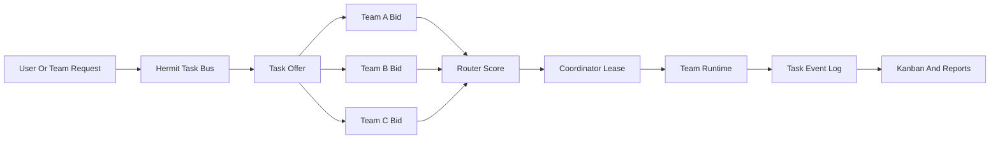
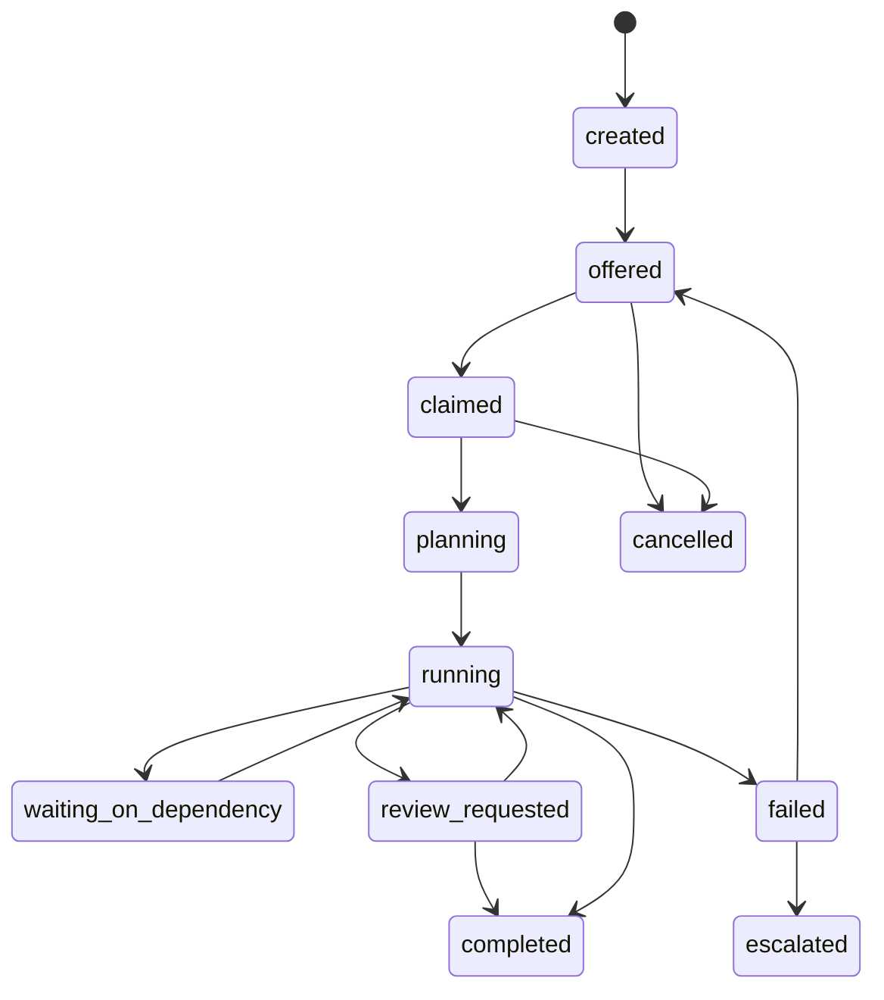

# Team Management Architecture

## 当前结论

Hermit 不应该模拟人类组织里的固定 Leader/Member 结构。更稳定的模型是：

> Hermit 是跨团队任务协议层，不是团队内部管理者。

每个团队由 cc-connect runtime 承载，团队内部如何计划、执行、重试、review，由团队自己的运行时和工作流决定。Hermit 只负责团队之间的任务协议、路由、状态机、审计和用户可见控制面。

## 架构分工

| 层级 | 责任 | 不负责 |
|------|------|--------|
| Hermit | 团队列表、渠道配置、跨团队任务协议、Kanban、事件审计、使用报告、Skills/MCP 全局管理 | 团队内部 todo、具体工具调用、成员内部协作细节 |
| Team runtime | 执行任务、内部计划、工具调用、局部重试、局部 review | 全局路由、跨团队审计、其他团队状态管理 |
| cc-connect | runtime 生命周期、渠道接入、消息投递、project 配置 | Hermit 业务状态、跨团队任务决策 |

Hermit 只读取和写入标准化事件，不深入解析某个团队内部如何完成任务。



## 核心模型

### Task Bus

Task Bus 是 Hermit 的跨团队协议层。所有跨团队任务先进入 Task Bus，再由团队认领、竞标或被用户指定。

Task Bus 记录的是跨团队协作事实，而不是团队内部 todo：

- 谁发起了任务
- 任务需要什么能力
- 哪些团队表示可以做
- 谁获得临时协调权
- 过程发生了哪些事件
- 最终结果是什么

### Task Offer

任务进入总线后形成一个 offer。

```typescript
interface TaskOffer {
  taskId: string;
  title: string;
  description?: string;
  intent: 'execute' | 'coordinate' | 'review';
  requiredCapabilities: string[];
  constraints?: {
    deadlineAt?: string;
    maxCost?: number;
    preferredTeams?: string[];
    blockedTeams?: string[];
  };
  priority: 'low' | 'normal' | 'high' | 'urgent';
  origin: {
    type: 'user' | 'team' | 'system';
    id: string;
  };
  createdAt: string;
}
```

`intent` 只影响路由和 UI，不产生三套系统。

| intent | 含义 |
|--------|------|
| `execute` | 单团队可完成的执行任务 |
| `coordinate` | 需要协调多个团队的任务 |
| `review` | 需要独立验证、背书或代码审查的任务 |

### Task Bid

团队不一定被强派任务。它可以先返回 bid，说明自己为什么适合做。

```typescript
interface TaskBid {
  bidId: string;
  taskId: string;
  teamId: string;
  confidence: number;
  estimatedTimeMinutes?: number;
  estimatedCost?: number;
  planSummary: string;
  risks?: string[];
  createdAt: string;
}
```

Hermit 的 router 根据可解释信号打分：

- capability 匹配度
- 当前负载
- 近期成功率
- 同类任务失败次数
- 用户指定偏好
- 预计成本和时间

第一版可以先支持用户手动选择 bid；自动选择放到后续版本。

### Coordinator Lease

协调者不是固定身份，而是某个任务上的临时 lease。

```typescript
interface CoordinatorLease {
  taskId: string;
  teamId: string;
  acquiredAt: string;
  expiresAt: string;
  renewCount: number;
  reason: string;
}
```

lease 的意义：

- 让任务有明确 owner
- 避免固定 Leader 瓶颈
- 超时后可切换协调者
- 所有切换都可审计

### Task Event Log

Hermit 的 Kanban、报告、审计都基于事件日志，而不是直接读取团队内部 todo。

```typescript
type TaskBusEventType =
  | 'task_offered'
  | 'bid_submitted'
  | 'bid_selected'
  | 'lease_acquired'
  | 'lease_renewed'
  | 'progress_reported'
  | 'dependency_created'
  | 'review_requested'
  | 'review_completed'
  | 'blocked'
  | 'completed'
  | 'failed'
  | 'escalated'
  | 'cancelled';

interface TaskBusEvent {
  eventId: string;
  taskId: string;
  type: TaskBusEventType;
  actor: {
    type: 'user' | 'team' | 'system';
    id: string;
  };
  summary: string;
  payload?: Record<string, unknown>;
  evidenceRefs?: string[];
  createdAt: string;
}
```

事件日志是最小可观察状态。团队内部可以有自己的计划、todo、loop、review 流程，但对 Hermit 只需要提交标准事件。

## 状态机

所有跨团队任务共用一套状态机。



| 状态 | 说明 |
|------|------|
| `created` | 任务刚创建，还未广播 |
| `offered` | 已进入任务市场，等待 bid 或认领 |
| `claimed` | 已选出负责人或协调者 |
| `planning` | 协调者正在拆解和安排 |
| `running` | 正在执行 |
| `waiting_on_dependency` | 等待子任务、外部输入或用户确认 |
| `review_requested` | 等待审核 |
| `completed` | 完成 |
| `failed` | 当前尝试失败，可重新 offer |
| `escalated` | 自动流程无法处理，升级给用户 |
| `cancelled` | 用户或系统取消 |

## 与现有代码的映射

现有实现不需要推倒重来，应该在当前模块上增量演进。

| 当前模块 | 未来职责 |
|----------|----------|
| `TeamWorkspaceService` | 本地 team/task 存储，新增 task bus repository |
| `TeamProvisioningService.dispatchTask()` | 从简单 assignee 推消息，升级为 Task Offer/Lease 投递 |
| `CcConnectBridge` | 继续负责把 Hermit 消息投递给 runtime |
| `src/shared/types/team.ts` | 增加 Task Bus 类型 |
| `src/main/server.ts` | 增加 `/api/task-bus/*` API |
| Renderer team store | 展示 bus 状态、lease、事件时间线 |

建议新增：

```text
src/main/services/teams-mvp/TaskBusService.ts
```

该服务负责：

- 创建 offer
- 接收 bid
- 选择 bid
- 写入 lease
- 记录事件
- 标记完成/失败/升级

## 本地存储结构

第一版继续使用本地文件，后续再替换为 Git/Redis/server-backed adapter。

```text
~/.hermit/task-bus/
  tasks/
    <taskId>.json
  events/
    <taskId>.jsonl
  leases/
    <taskId>.json
```

文件语义：

- `tasks/<taskId>.json`：任务 offer、当前状态、选中的 coordinator
- `events/<taskId>.jsonl`：不可变事件流
- `leases/<taskId>.json`：当前协调者 lease，可过期和续租

## API 草案

```text
POST /api/task-bus/offers
GET  /api/task-bus/tasks/:taskId
GET  /api/task-bus/tasks/:taskId/events
POST /api/task-bus/tasks/:taskId/bids
POST /api/task-bus/tasks/:taskId/select
POST /api/task-bus/tasks/:taskId/lease/renew
POST /api/task-bus/tasks/:taskId/events
POST /api/task-bus/tasks/:taskId/review
POST /api/task-bus/tasks/:taskId/complete
POST /api/task-bus/tasks/:taskId/fail
```

这些 API 只操作跨团队协议状态，不直接控制团队内部 todo。

## Agent 可用动作

后续 MCP/Skill 只暴露少量稳定动作：

```text
task_bus_list_offers()
task_bus_bid(taskId, confidence, planSummary, estimate)
task_bus_claim(taskId)
task_bus_report(taskId, status, summary, evidenceRefs)
task_bus_request_review(taskId, reviewerTeam)
task_bus_complete(taskId, result)
task_bus_fail(taskId, reason)
```

Agent 不应该直接改 Hermit 内部数据结构，只能提交事件或请求状态转换。

## UI 设计

第一版 UI 不需要复杂自动化，只需要让用户看懂发生了什么。

任务卡展示：

- `intent`
- 当前 `TaskBusStatus`
- coordinator team
- lease 剩余时间
- 是否等待 review

任务详情展示：

- bid 列表
- 选择原因
- event timeline
- 子任务/依赖
- review result

## 实施顺序

1. 定义 shared types 和本地 repository。
2. 新增 `TaskBusService`，支持 offer、event、lease。
3. 新增 `/api/task-bus/*`，先给 UI 和手动测试用。
4. 把现有 `dispatchTask()` 改成创建 offer + 投递给目标团队。
5. UI 展示 task bus 状态和事件时间线。
6. 加入 bid/score，先手动选择，再做自动选择。
7. 加入 review 分支和 structured review result。

## 历史文档

本目录下的 research 和 plan 文档保留为历史研究材料：

- `research-messaging.md`
- `research-inbox.md`
- `research-tasks.md`
- `research-worktrees.md`
- `research-cli-orchestration.md`
- `opencode-native-semantic-messaging-plan.md`
- `task-queue-derived-agenda-plan.md`

以后新实现以本文为 canonical 入口。若历史文档与本文冲突，以本文为准。
