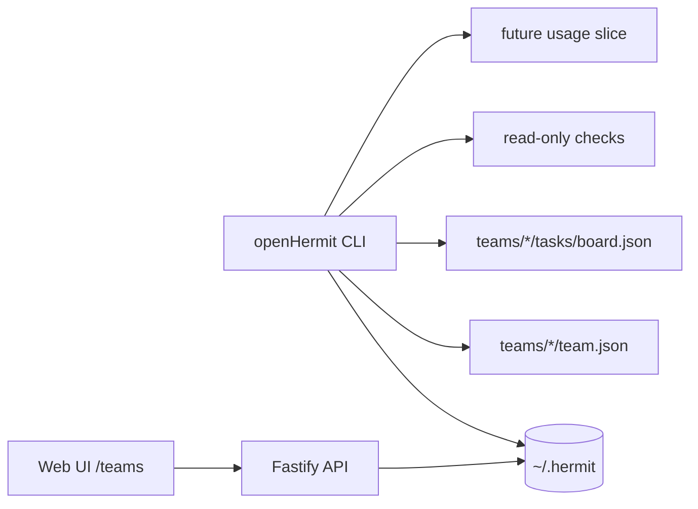

# Implementation Plan: openHermit CLI for Agents and Operators

## Summary

Build the openHermit CLI as the agent/operator entry point for the existing local workspace.

The first phase is **not usage-only**. It establishes a read-only CLI foundation:

- no-Web command dispatch;
- text and `--json` output;
- `status` structured output;
- `doctor` read-only diagnostics;
- `teams list` local workspace projection;
- `tasks list --team <slug>` local task projection.

Local Claude Code usage commands become the next vertical slice after the foundation is in place.

## Product Framing

```text
Web UI for humans. CLI for agents and operators.
```

The CLI is not a separate product. It is the second entry point into the same local openHermit workspace under `~/.hermit/`.

## Architecture



## Phase 1 Commands

```bash
hermit status
hermit status --json
hermit doctor
hermit doctor --json
hermit teams list
hermit teams list --json
hermit tasks list --team <team>
hermit tasks list --team <team> --json
```

Equivalent package binaries:

```bash
openhermit status --json
open-hermit teams list --json
```

## Implementation Notes

### CLI Dispatch

Modify `bin/hermit.mjs` before dependency checks and runtime startup:

1. parse global `--json`;
2. intercept `status`, `doctor`, `teams list`, `tasks list`;
3. print text or JSON;
4. exit without starting Web UI or hermit-bridge.

`status` already exists. Extend it to support JSON without changing its text behavior.

### Filesystem Projection

Phase one can use small plain-ESM read-only helpers in `bin/hermit.mjs` because importing TypeScript services directly requires tsx and path-alias loading. Keep duplication narrow and aligned with `TeamWorkspaceService`:

```text
HERMIT_HOME || ~/.hermit
  teams/<slug>/team.json
  teams/<slug>/tasks/board.json
```

Rules:

- missing directories return empty lists;
- malformed JSON is skipped with warnings;
- reserved system teams are hidden from `teams list`;
- `tasks list` resolves direct storage slug first, then `bindProject` alias;
- tasks with `result === "__deleted__"` are hidden;
- task statuses map to API vocabulary.

### Doctor Checks

Read-only checks only:

- selected port and `/api/version` reachability;
- daemon pidfile state and process liveness;
- `HERMIT_HOME` path existence;
- teams directory existence;
- hermit-bridge config file existence;
- Claude Code projects directory existence.

Do not call helpers that create or migrate bridge config.

### Usage Follow-Up

After phase one, add:

```bash
hermit usage today
hermit usage status
hermit usage report
hermit usage start
```

Reuse existing `SessionUsageParser.scanSessions()` and add privacy-safe reporting modules. Keep IM usage and local Claude Code usage separate.

## Testing Strategy

### Test-first Check

No focused tests currently cover `bin/hermit.mjs` command projections. Add smoke-level tests or shell-based CLI tests if practical. At minimum, verify with direct CLI invocations using a temporary `HERMIT_HOME` fixture.

### Verification Commands

```bash
HERMIT_HOME=$(mktemp -d) node bin/hermit.mjs status --json
HERMIT_HOME=$(mktemp -d) node bin/hermit.mjs doctor --json
HERMIT_HOME=$(mktemp -d) node bin/hermit.mjs teams list --json
HERMIT_HOME=<fixture> node bin/hermit.mjs tasks list --team <team> --json
pnpm typecheck 2>&1 | tail -20
```

## Rollout

1. Land read-only CLI foundation.
2. Add local usage today/status commands.
3. Add metadata-only report/queue/upload gate.
4. Add future write commands only after read-only commands are stable.

## Risks And Mitigations

| Risk | Mitigation |
| --- | --- |
| CLI JSON polluted by logs | Intercept commands before runtime startup and avoid logging in JSON mode |
| Drift from server mapping | Keep filesystem projection small and mirror `TeamWorkspaceService`/server status mapping |
| Usage scope expands too early | Treat usage reporting as phase two, not the phase-one definition |
| Secrets leak from doctor | Never print bridge tokens or raw config contents |
