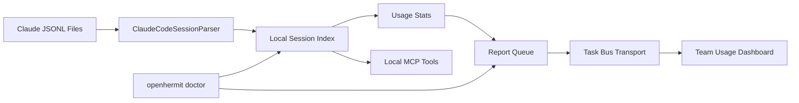

# Implementation Plan: Task Bus Usage Telemetry

## Summary

Implement local-first, metadata-only usage telemetry that activates when Task Bus is enabled.

This is not transcript monitoring. It is usage/cost/activity reporting:

- parse local Claude Code JSONL in read-only mode
- build local session index and stats
- queue metadata reports
- expose team dashboard metrics
- provide doctor checks

## CCPal Ideas To Reuse

| CCPal Capability | openHermit Adaptation |
|------------------|-----------------------|
| Read `~/.claude/projects/**/*.jsonl` | `ClaudeCodeSessionParser` |
| `/stats` page | Team usage dashboard |
| `/budget` rolling token view | Daily/weekly token trend and anomaly cards |
| `/health` activity view | Active days and last-seen usage health |
| MCP tools | Local-only session MCP tools |
| `ccpal-doctor.sh` | `openhermit doctor` checks |
| No raw JSONL mutation | Read-only parser and derived index |

## Architecture



## Storage

```text
~/.hermit/session-index/
  sessions.json
  stats.json
  state.json
  queue.jsonl
  diagnostics.json
```

### Files

- `sessions.json`: normalized metadata for locally observed sessions
- `stats.json`: precomputed aggregate stats for dashboard and local MCP
- `state.json`: source file mtime/size/high-water marks
- `queue.jsonl`: pending metadata reports
- `diagnostics.json`: last scan errors and doctor hints

## Parser Contract

```typescript
interface HarnessSessionParser {
  harness: string;
  scanRoots(): string[];
  scan(): Promise<DiscoveredSessionFile[]>;
  parse(file: DiscoveredSessionFile): Promise<LocalSessionUsage | null>;
}
```

V1 implements only:

```text
ClaudeCodeSessionParser
```

## Metadata Report Contract

```typescript
interface UsageReport {
  schemaVersion: 1;
  teamId: string;
  memberId: string;
  machineName: string;
  generatedAt: string;
  sessions: LocalSessionUsage[];
}
```

No content fields are allowed in this payload.

## Task Bus Integration

When Task Bus is enabled:

1. `TaskBusSection` saves enabled state.
2. Main process starts or schedules local usage collection.
3. Collector writes local index.
4. Collector queues metadata report.
5. Task Bus transport flushes queue.
6. Dashboard reads aggregated metadata.

When Task Bus is disabled:

- local index may remain available for the owner
- no team telemetry reports are sent
- queue flushing is disabled

## New Services

```text
src/main/services/session-intelligence/
  ClaudeCodeSessionParser.ts
  SessionIndexRepository.ts
  SessionUsageAggregator.ts
  UsageReportQueue.ts
  UsageTelemetryService.ts
  UsageDoctorService.ts
```

## New API

```text
GET  /api/session-intelligence/local/stats
GET  /api/session-intelligence/local/sessions
POST /api/session-intelligence/scan
GET  /api/session-intelligence/doctor
GET  /api/team-usage/dashboard
POST /api/team-usage/reports
```

## Renderer

Add to Task Bus settings:

- notice that enabling Task Bus enables metadata telemetry
- last scan time
- queue size
- doctor status
- explicit statement: no prompts, responses, file contents, or shell args are uploaded

Add dashboard section:

- tokens by member
- sessions by member
- active days
- trend chart
- harness split
- tool call counts

## Privacy Rules

Default report must not include:

- prompt text
- assistant text
- transcript
- raw JSONL
- full project path
- file content
- shell command arguments
- tool arguments

Only hashes, counts, timestamps, and user-defined labels are allowed.

## Implementation Phases

### Phase 1: Local Index

Build read-only Claude JSONL parser and local index.

### Phase 2: Stats And Doctor

Compute usage stats and add `openhermit doctor` checks.

### Phase 3: Task Bus Telemetry

Wire Task Bus enabled state to metadata queue and report transport.

### Phase 4: Dashboard

Render team usage metrics.

### Phase 5: Local MCP

Expose local-only session tools for personal memory retrieval.

## Risks

| Risk | Mitigation |
|------|------------|
| Accidentally uploading content | Report schema whitelist, no raw metadata passthrough |
| Large JSONL files | Incremental state by mtime/size |
| Corrupt partial JSONL | Skip bad lines and record diagnostics |
| User trust | Clear UI copy and visible telemetry indicator |
| Cross-platform background jobs | Start with app-driven collection, add OS services later |
